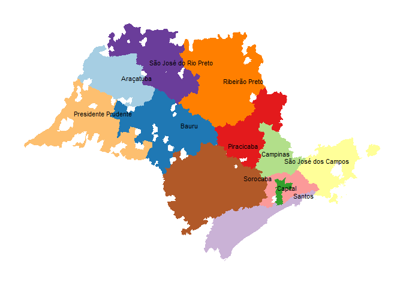
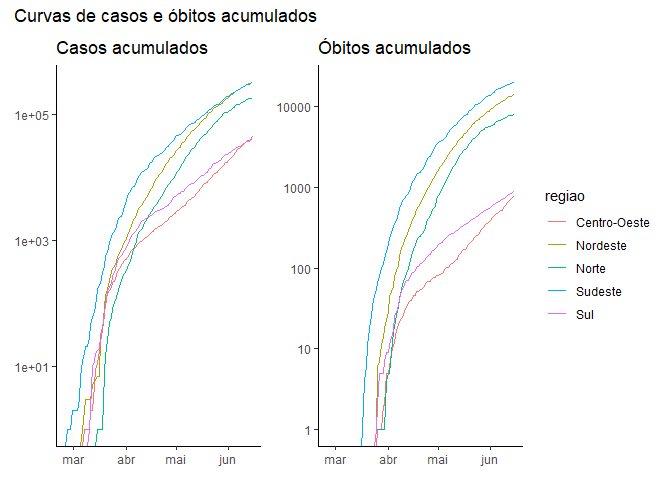

<!-- README.md is generated from README.Rmd. Please edit that file -->

# CRIME E COVID: uma relação viral? \[1\]

## APRESENTAÇÃO

O presente trabalho visa realizar uma singela análise sobre os índices
de criminalidade no Estado de São Paulo e compará-los aos números da
pandemia causada pela COVID-19.\[2\]

Pretendemos verificar as consequências da pandemia (dentre eles, a breve
quarentena que se verificou no estado) e levantar algumas reflexões
sobre os impactos da violência. Dentre as perguntas que se pretende
refletir (mas sem a pretensão de oferecer respostas):

1.  *Qual é, em linhas gerais, a **tendência de evolução** da incidência
    criminal em SP? Os crimes têm, ao longo das últimas décadas
    **diminuído** ou **aumentado**?*

2.  *É possível visualizar **tendências** nas diferentes regiões da
    cidade*?

3.  *Como foi o comportamento dessas tendências **durante os meses em
    que a quarentena** em SP foi mais intensa*? *Houve **padrão** nos
    distintos tipos de crime e nas distintas regiões*?

4.  S*e houve comportamento fora do padrão ou **inesperado**, quais
    poderiam ser as razões*?

Ao final, queremos instigar a seguinte provocação na leitora e no
leitor: as projeções e sonhos que temos para um “novo normal” não
deveriam ter em mente, também, a “pandemia” de violência em nosso
Estado?

## DADOS UTILIZADOS

Vamos analisar as bases :

  - `COVID`, contendo [dados coletados e tratados pela equipe da
    Curso-R](https://www.youtube.com/watch?v=ja2AbTFN4yk&ab_channel=Curso-R)
    a partir de webscrap do [site do Ministério da
    Saúde](http://covid.saude.gov.br). Os dados estão atualizados
    15/06/2020;
  - `SSP`, oriundos da mesma Curso-R, com dados extraídos da [Secretaria
    de Segurança Pública de São
    Paulo](http://www.ssp.sp.gov.br/transparenciassp/Consulta.aspx). Os
    dados são de janeiro de 2002 até abril de 2020.

## METODOLOGIA

Ambas as bases, embora pré-processadas e em formato *tidy*, receberam
tratamento a fim de torná-las comparáveis entre si. O detalhamento dos
passos fica mais evidente nos comentários nos arquivos nas pastas `/R` e
`/data-raw`, porém a seguir trazemos os aspectos mais significativos.

### *Tratamento dos dados da COVID*

Os dados foram restritos ao estado de **São Paulo** e foram removidas
variáveis como a quantidade de novos casos, casos recuperados, etc, uma
vez que o foco da análise se deu sobre dois indicadores:

  - **Incidência de casos**: ou seja, a quantidade de casos confirmados
    por 100 mil habitantes

  - **Mortalidade** (ou incidência de mortes): a quantidade de óbitos
    confirmados por 100 mil habitantes

|                                                                                                                               Variáveis originais                                                                                                                                |         Variáveis finais          |
| :------------------------------------------------------------------------------------------------------------------------------------------------------------------------------------------------------------------------------------------------------------------------------: | :-------------------------------: |
| regiao, estado, municipio, coduf, codmun, codRegiaoSaude, nomeRegiaoSaude, data, semanaEpi, populacaoTCU2019, casosAcumulado, casosNovos, obitosAcumulado, obitosNovos, Recuperadosnovos, emAcompanhamentoNovos, eh\_capital, obitosAcumulado\_log2, obitosNovos\_log2, lat, lon | regiao, mes, variavel, quantidade |

*Tab 1. Variáveis da base de dados COVID antes e depois do tratamento*

### *Tratamento dos dados da SSP*

A base originalmente continha variáveis em sub-espécies dos crimes
cometidos, separando por exemplo homicídios de homicídios culposos. Para
melhor aproveitamento dos dados, considerando os bens jurídicos
inerentes a cada tipo penal, as hipóteses originais foram dividas em
quatro grupos:

  - **Crimes Violentos Letais Intencionais (CVLI)**: reunindo homicídios
    dolosos, latrocínio (também chamado de roubo seguido de morte) e
    lesão corporal seguida de morte. Para fins desse estudo, se incluiu
    nesse grupo também os homicídios tentados (que, por definição, são
    intencionais), ainda que o óbito não tenha necessariamente ocorrido.

  - **Crimes contra o patrimônio**: Reunindo roubos (exceto se
    resultantes em óbito) e furtos (de qualquer tipo).

  - **Outros crimes contra a pessoa**: Reunindo estupros (em todas as
    modalidades) e lesões corporais. Sabe-se que ambos possuem grande
    diferença quanto aos contextos criminológicos em que ocorrem, porém
    apenas e exclusivamente para fins metodológicos fez sentido
    agrupá-los aquo.

  - **Acidentes penalmente relevantes:** Agrupou-se os crimes de
    trânsito (inclusive as modalidades dolosas), lesões corporais
    culposas e homicídios culposos. Da mesma forma que no caso anterior,
    a proposta é unicamente didática, tendo em mente que todos os crimes
    aqui descritos possuem um aspecto subjetivamente não-intencional,
    mesmo nos casos de dolo eventual.

|                                                                                                                                                                                                                                                               Variáveis originais                                                                                                                                                                                                                                                                |                  Variáveis finais                   |
| :----------------------------------------------------------------------------------------------------------------------------------------------------------------------------------------------------------------------------------------------------------------------------------------------------------------------------------------------------------------------------------------------------------------------------------------------------------------------------------------------------------------------------------------------: | :-------------------------------------------------: |
| mes, ano, delegacia\_nome, municipio\_nome, regiao\_nome, estupro, estupro\_total, estupro\_vulneravel, furto\_outros, furto\_veiculos, hom\_culposo\_acidente\_transito, hom\_culposo\_outros, hom\_doloso, hom\_doloso\_acidente\_transito, hom\_tentativa, latrocinio, lesao\_corp\_culposa\_acidente\_transito, lesao\_corp\_culposa\_outras, lesao\_corp\_dolosa, lesao\_corp\_seg\_morte, roubo\_banco, roubo\_carga, roubo\_outros, roubo\_total, roubo\_veiculo, vit\_hom\_doloso, vit\_hom\_doloso\_acidente\_transito, vit\_latrocinio | ano, regiao, tipo\_crime, quantidade, qnt\_relativa |

*Tab 2. Variáveis da base SSP antes e após tratamento*

### Convergência dos dados

A fim de que se pudesse tornar os dados estudados comparáveis em algumas
medidas, adotou-se os seguintes padrões:

  - Os dados de **população**, oriundos das projeções do Tribunal de
    Contas da União (TCU) para 2019, foram aproveitados para ambas as
    bases. Elas vieram originalmente na base `COVID` e foi daptada para
    a base `SSP`.

  - Como as bases possuiam recortes temporais distintos, os dados de
    segurança da `SSP`foram *projetados até o final do an*o,
    considerando as tendências até abril/2020.

  - As **regiões** da Segurança Pública (base `SSP`) foram aproveitadas
    também para os dados da pandemia (base `COVID`). Assim, os dados
    foram apresentados considerando as mesmas 12 regiões.

<!-- -->

## ESTADO DE SÃO PAULO E A COVID-19

Como é sabido, o Brasil chegou rapidamente aos países com mais casos no
mundo. Ao contrário do que se disse, esse número não se deu unicamente
em razão da grandeza de sua população.

Por outro lado, o Estado de São Paulo foi por muito tempo o “epicentro”
da pandemia no país. Além de sua alta população, possivelmente houve
influência da sua alta urbanização dentre muitos outros fatores.

Válido, portanto, retomar um pouco dos impactos da COVID no país

<!-- --><!-- --><!-- -->

### Incidência de casos e Mortalidade em SP

Podemos ver que

|        Região         | Tx. Incidência | Tx. Mortalidade |
| :-------------------: | :------------: | :-------------: |
|       Araçatuba       |      99,8      |       5,8       |
|         Bauru         |     138,6      |       4,5       |
|       Campinas        |     234,4      |      10,7       |
|        Capital        |     762,7      |      46,1       |
|   Grande São Paulo    |     424,2      |      32,3       |
|      Piracicaba       |     134,6      |       5,9       |
|  Presidente Prudente  |      85,1      |       5,0       |
|    Ribeirão Preto     |     135,9      |       4,5       |
|        Santos         |     632,1      |      27,8       |
| São José do Rio Preto |     178,2      |       6,1       |
|  São José dos Campos  |     150,1      |       5,2       |
|       Sorocaba        |     148,8      |       7,0       |

<!-- -->

## O CRIME E O ESTADO DE SÃO PAULO

### Tendências

Dizer alguma coisa que a tendência é de queda

<!-- -->

São Paulo, crimes, bla bla bla Tendência de queda por diversos fatores

<!-- -->

### Criminalidade durante a pandemia

#### Quarentena

|     Crime      |  2015   |  2016   |  2017   |  2018   |  2019   |  2020   |
| :------------: | :-----: | :-----: | :-----: | :-----: | :-----: | :-----: |
|      CVLI      |  19,3   |  17,9   |  16,9   |  15,3   |  14,4   |  14,5   |
|   patrimonio   | 1.996,0 | 2.075,9 | 2.145,6 | 1.983,0 | 1.946,6 | 1.634,6 |
| contra\_pessoa |  325,3  |  327,6  |  323,4  |  306,1  |  312,5  |  262,5  |
|   acidentes    |  264,6  |  231,5  |  212,0  |  182,8  |  179,8  |  134,2  |

Durou em especial nos primeiros meses

Qual impacto teve nos índices?

#### Perguntas importantes

Houve diminuição ou aumento dos crimes?

Houve diminuição das ocorrências de crimes contra o patrimônio?

Lesões corporais e estupros - como foram? pessoas em casa

Acidentes de carro - diminuição da circulação, fechamento dos bares,
lojas de conveniência, etc

Fechamento das delegacias na pandemia\!\!\!

Mas e os CVLI? Qual o impacto? Esses tendem a ter menos subnotificação

Levantar o ponto da letalidade policial

#### Regiões que tiveram aumento

<!-- -->

Da visualização do gráfico notamos que **todas** as categorias de crimes
demonstram redução em 2020, exceto uma, *CVLI*. Ou seja, destoando dos
demais tipos de crime, tudo indica que em 2020 haverá - ao menos em
parte das regiões - mais CVLI do que o ano passado.

Pertinente, então, observarmos **quais** regiões tiveram esse
comportamento.

<table class=" lightable-paper lightable-striped" style="font-family: &quot;Arial Narrow&quot;, arial, helvetica, sans-serif; width: auto !important; margin-left: auto; margin-right: auto;">

<thead>

<tr>

<th style="text-align:center;">

Região

</th>

<th style="text-align:center;">

População

</th>

<th style="text-align:center;">

2019

</th>

<th style="text-align:center;">

2020

</th>

<th style="text-align:center;">

\<U+0394\>%

</th>

</tr>

</thead>

<tbody>

<tr>

<td style="text-align:center;">

Araçatuba

</td>

<td style="text-align:center;">

784.310

</td>

<td style="text-align:center;">

22,3

</td>

<td style="text-align:center;">

34,2

</td>

<td style="text-align:center;">

53,5

</td>

</tr>

<tr>

<td style="text-align:center;">

Bauru

</td>

<td style="text-align:center;">

1.867.184

</td>

<td style="text-align:center;">

14,4

</td>

<td style="text-align:center;">

17,8

</td>

<td style="text-align:center;">

23,7

</td>

</tr>

<tr>

<td style="text-align:center;">

Campinas

</td>

<td style="text-align:center;">

3.809.471

</td>

<td style="text-align:center;">

14,7

</td>

<td style="text-align:center;">

14,8

</td>

<td style="text-align:center;">

0,5

</td>

</tr>

<tr>

<td style="text-align:center;">

Capital

</td>

<td style="text-align:center;">

12.252.023

</td>

<td style="text-align:center;">

12,4

</td>

<td style="text-align:center;">

11,4

</td>

<td style="text-align:center;">

\-7,8

</td>

</tr>

<tr>

<td style="text-align:center;">

Grande São Paulo

</td>

<td style="text-align:center;">

9.413.274

</td>

<td style="text-align:center;">

13,0

</td>

<td style="text-align:center;">

13,7

</td>

<td style="text-align:center;">

4,8

</td>

</tr>

<tr>

<td style="text-align:center;">

Piracicaba

</td>

<td style="text-align:center;">

3.314.154

</td>

<td style="text-align:center;">

13,2

</td>

<td style="text-align:center;">

14,7

</td>

<td style="text-align:center;">

12,1

</td>

</tr>

<tr>

<td style="text-align:center;">

Presidente Prudente

</td>

<td style="text-align:center;">

1.079.896

</td>

<td style="text-align:center;">

11,4

</td>

<td style="text-align:center;">

10,8

</td>

<td style="text-align:center;">

\-4,8

</td>

</tr>

<tr>

<td style="text-align:center;">

Ribeirão Preto

</td>

<td style="text-align:center;">

3.666.016

</td>

<td style="text-align:center;">

14,2

</td>

<td style="text-align:center;">

12,8

</td>

<td style="text-align:center;">

\-10,1

</td>

</tr>

<tr>

<td style="text-align:center;">

Santos

</td>

<td style="text-align:center;">

2.145.688

</td>

<td style="text-align:center;">

19,9

</td>

<td style="text-align:center;">

16,6

</td>

<td style="text-align:center;">

\-16,5

</td>

</tr>

<tr>

<td style="text-align:center;">

São José do Rio Preto

</td>

<td style="text-align:center;">

1.552.180

</td>

<td style="text-align:center;">

15,3

</td>

<td style="text-align:center;">

11,6

</td>

<td style="text-align:center;">

\-24,4

</td>

</tr>

<tr>

<td style="text-align:center;">

São José dos Campos

</td>

<td style="text-align:center;">

2.515.574

</td>

<td style="text-align:center;">

25,7

</td>

<td style="text-align:center;">

29,1

</td>

<td style="text-align:center;">

13,1

</td>

</tr>

<tr>

<td style="text-align:center;">

Sorocaba

</td>

<td style="text-align:center;">

3.119.491

</td>

<td style="text-align:center;">

13,7

</td>

<td style="text-align:center;">

12,7

</td>

<td style="text-align:center;">

\-7,2

</td>

</tr>

</tbody>

</table>

Observamos então que as regiões de Araçatuba, Bauru,

<!-- -->

## Incidências de crime

Temos regiões com mais crime que covid?

Temos uma pandemia de violência?

Vamos olhar para as cidades que tiveram ao menos um registro de óbito
por COVID. Elas totalizam 286 cidades.

Dessas, vamos verificar se e quais cidades tiveram mais óbitos por COVID
do que por CVLI. Embora imperfeita, a comparação é possível considerando
que o resultado dos CVLI é praticamente sempre o óbito.

<table class=" lightable-paper lightable-hover" style="font-family: &quot;Arial Narrow&quot;, arial, helvetica, sans-serif; width: auto !important; margin-left: auto; margin-right: auto;">

<thead>

<tr>

<th style="text-align:center;">

municipio

</th>

<th style="text-align:center;">

populacao

</th>

<th style="text-align:center;">

CVLI

</th>

<th style="text-align:center;">

obito\_covid

</th>

<th style="text-align:center;">

causa\_maior

</th>

</tr>

</thead>

<tbody>

<tr>

<td style="text-align:center;">

São Paulo

</td>

<td style="text-align:center;">

12.252.023

</td>

<td style="text-align:center;">

4,0

</td>

<td style="text-align:center;">

34,9

</td>

<td style="text-align:center;">

covid

</td>

</tr>

<tr>

<td style="text-align:center;">

Santos

</td>

<td style="text-align:center;">

433.311

</td>

<td style="text-align:center;">

28,8

</td>

<td style="text-align:center;">

34,2

</td>

<td style="text-align:center;">

covid

</td>

</tr>

<tr>

<td style="text-align:center;">

Embu-Guaçu

</td>

<td style="text-align:center;">

69.385

</td>

<td style="text-align:center;">

0,0

</td>

<td style="text-align:center;">

14,4

</td>

<td style="text-align:center;">

covid

</td>

</tr>

<tr>

<td style="text-align:center;">

São Luiz do Paraitinga

</td>

<td style="text-align:center;">

10.687

</td>

<td style="text-align:center;">

0,0

</td>

<td style="text-align:center;">

9,4

</td>

<td style="text-align:center;">

covid

</td>

</tr>

<tr>

<td style="text-align:center;">

Uchoa

</td>

<td style="text-align:center;">

10.110

</td>

<td style="text-align:center;">

0,0

</td>

<td style="text-align:center;">

9,9

</td>

<td style="text-align:center;">

covid

</td>

</tr>

<tr>

<td style="text-align:center;">

Tarabai

</td>

<td style="text-align:center;">

7.468

</td>

<td style="text-align:center;">

0,0

</td>

<td style="text-align:center;">

13,4

</td>

<td style="text-align:center;">

covid

</td>

</tr>

</tbody>

</table>

## Próximos temas

Diante do que foi exposto, creio ser possível levantar algumas questões
para estudos futuros e mais aprofundados:

  - Considerando que em CVLI não são englobadas as mortes causadas por
    intervenção policial, é importante considerar esse aspecto.

  - Observar dados mais atualizados tanto de crimes quanto de COVID pois
    é possível que a taxa constante de crimes não tenha sido superada
    pelas da pandemia.

## Notas

1.  A ideia do nome veio de uma excelente matéria da [Revista
    piauí](https://piaui.folha.uol.com.br/crime-e-covid-no-rio/)

2.  Ele se dá no contexto de conclusão do [Curso de R para Ciência de
    Dados](https://www.curso-r.com/cursos/r4ds-2/) e, portanto, não tem
    grandes pretensões científicas.
